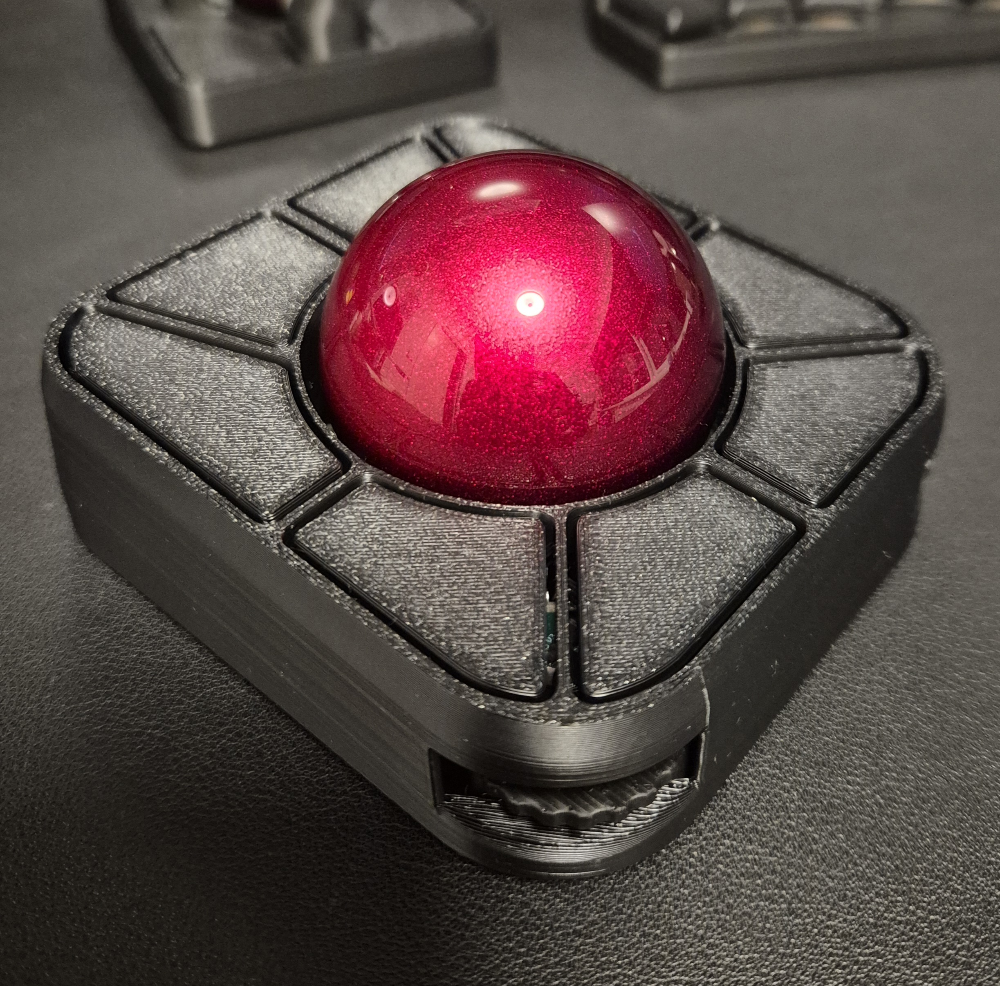

# About

This shell is a modification of the Endgame trackball [original shell](https://github.com/efogtech/endgame-trackball-3d-models/tree/d8d5728113b2dd74e77fdc04e657dafa912cdaab).

These files include only the top shell; the bottom is compatible with the original.

The main differences are:

- All buttons use compliant springs, so the shell is slightly raised and slanted to make room for them.
- The internal ball cup is removed, and the encoder openings are larger to make it easier to insert and remove the shell without breaking the encoders.
- No need for heat inserts; four M2 screws between 5 and 10 mm can be screwed directly into the shell.
- The shape of the buttons is slightly changed so they follow the shape of the shell; the buttons on the bottom of the shell are also a bit larger.
- No magnetic buttons. Since the shell is angled, the buttons are much more accessible, so I didn't feel the need for them. It would also complicate the design of the bridges.

Known limitations:

- More clearance is needed for the 55 mm ball; it only works if the BTU on the bottom is not fully inserted. I may add this if there is interest.
- The middle buttons (top and bottom) are a bit harder to press than the side buttons because the springs are shorter. It might be possible to improve this as well.

# Instructions

- Print with the buttons facing the build plate and add supports only on the build plate. The encoder holes need support because the shell is angled, but these are the only supports required.
- The recommended layer height is 0.2 mm.
- Works with PLA and PETG. PETG is a better option but a bit harder to print.
- Use four M2 screws to fasten the top to the bottom. Any length between 5 and 10 mm should work fine.
